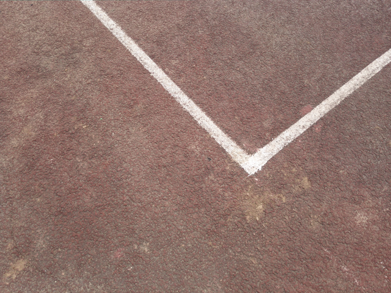
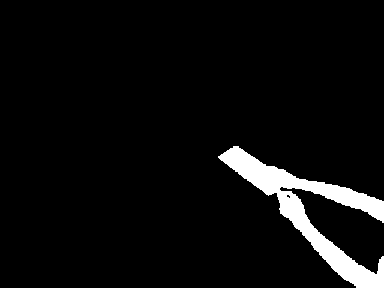
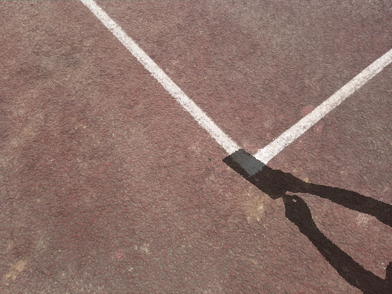

# Composition

Use alpha parameter to combine shadow and image directly. The shadow produced in this manner is of poor quality. But it is very efficient and can produce large-scale shadow data easily.

Require opencv and numpy module.

## Your folder structure should look like this:
```
Composition
 ┣ input(Place all your shadow-free images here)
 ┣ mask(Place all your shadow mask images here)
 ┣ output(Your shadow images will be generated here)
 ┣ alpha.py
 ┗ README.md
```

## Command to run the program.
```python
python alpha.py --alpha_min min_alpha --alpha_max max_alpha --height image_height --width image_width --mode align or random --num_shadow only available in random mode
```
### Note
min_alpha and max_alpha are between 0 and 1

align mode means that your shadow-free and shadow mask form 1 to 1 pair and they share the same name and format

random mode will pick random mask from the mask folder and combine with input file

num_shadow generate multiple shadow images at a time, only available in random mode

## Example input


## Example mask


## Example output
