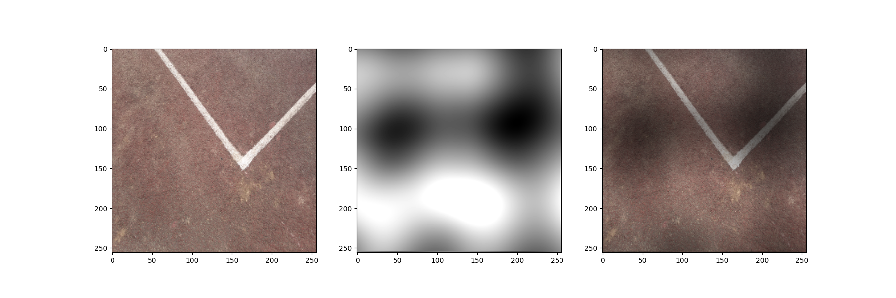

# Generation

This is a shadow generation method. The shadow produced in this manner is of high quality. But it requires more resources.

Based on [GitHub - google/portrait-shadow-manipulation](https://github.com/google/portrait-shadow-manipulation)

Require tensorflow==1.15, opencv, numpy and scipy module.

## Your folder structure should look like this:

```
Generation
 ┣ input(Place all your shadow-free images here)
 ┣ mask(Your mask images will be generated here)
 ┣ output(Your shadow images will be generated here)
 ┣ gen_shadow.py
 ┣ datasets.py
 ┣ utils.py
 ┗ README.md
```

## Command to run the program.

```python
python gen_shadow.py --min_val min_val --height image_height --width image_width
```

### Note
Render per-pixel intensity variation mask within [min_val, 1.]

Only support jpg & png format images

## Example
